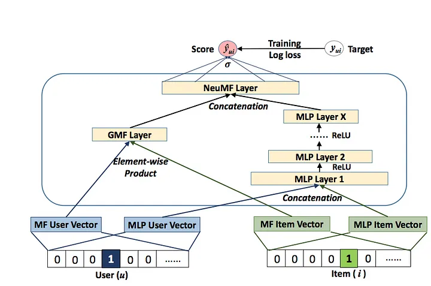
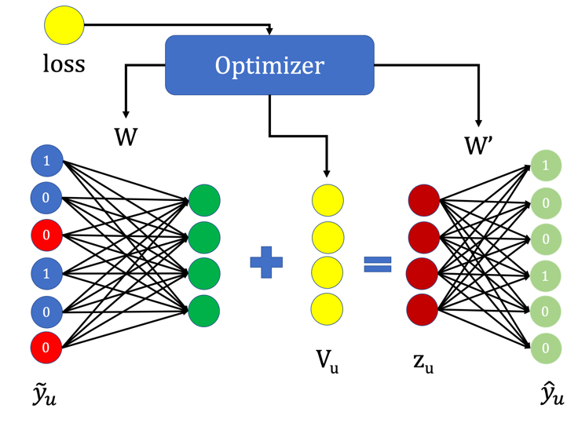

# 🎬 DeepMovieLens: Deep Learning-Based Movie Recommendation System

This repository contains a Deep Learning-based Movie Recommendation System implemented as a course project for **Deep Learning for Perception**. The goal was to build and evaluate personalized top-N recommendation models using cutting-edge collaborative filtering techniques.

We implemented and compared two state-of-the-art deep learning-based methods:

- **Neural Collaborative Filtering (NCF)**
- **Collaborative Denoising Auto-Encoders (CDAE)**

Both models were trained and evaluated on the large-scale [MovieLens 25M](https://grouplens.org/datasets/movielens/25m/) dataset.

---

## 📑 Table of Contents

- [📌 Project Objectives](#-project-objectives)
- [📂 Dataset: MovieLens 25M](#-dataset-movielens-25m)
- [🧠 Model Architectures](#-model-architectures)
  - [🔸 Neural Collaborative Filtering (NCF)](#-neural-collaborative-filtering-ncf)
  - [🔸 Collaborative Denoising Auto-Encoders (CDAE)](#-collaborative-denoising-auto-encoders-cdae)
- [🔍 Methodology](#-methodology)
- [📈 Evaluation & Results](#-evaluation--results)
  - [📊 Neural Collaborative Filtering (NCF)](#-neural-collaborative-filtering-ncf)
  - [📊 Collaborative Denoising Auto-Encoders (CDAE)](#-collaborative-denoising-auto-encoders-cdae)
- [📁 Notebooks](#-notebooks)
- [⚙️ Requirements](#-requirements)
- [🔮 Future Work](#-future-work)
- [📚 References](#-references)
- [👨‍💻 Team Members](#-team-members)
- [🏫 Academic Info](#-academic-info)
- [📬 Contact](#-contact)
- [⭐️ Show Your Support](#-show-your-support)

---

## 📌 Project Objectives

- Develop a scalable recommender system using deep learning techniques.
- Convert explicit ratings into implicit feedback for binary classification.
- Reproduce, adapt, and compare NCF and CDAE from academic research.
- Evaluate and interpret the performance using industry-standard metrics.
- Gain hands-on experience with model training, loss functions, and top-K evaluation.

---

## 📂 Dataset: MovieLens 25M

- Contains **25 million** user ratings on **over 62,000 movies** from **162,000 users**.
- Ratings range from 0.5 to 5.0 stars (explicit feedback).
- For this project, we:
  - Converted ratings to **implicit feedback** (watched = 1, not watched = 0).
  - Filtered out users with fewer than 5 interactions.
  - Created a **binary interaction matrix** for model input.

---

## 🧠 Model Architectures

### 🔸 Neural Collaborative Filtering (NCF)

A hybrid model that combines Generalized Matrix Factorization (GMF) and Multi-Layer Perceptrons (MLP) to learn user-item interaction patterns.



**Key Components**:
- Embedding layers for users and items.
- GMF: Element-wise multiplication of embeddings.
- MLP: Concatenated embeddings passed through dense layers.
- Fusion of GMF and MLP outputs.
- Final sigmoid layer to predict interaction probability.

1. **Embedding Layers**:
    - The model starts with embedding layers for both users and movies, where each user and movie is represented by a dense vector of fixed size.
    - These embedding vectors capture latent features that reflect user preferences and movie characteristics.

2. **GMF Branch**:
    - The GMF branch performs a simple dot product between the user and movie embeddings.
    - This **linear** interaction captures the collaborative filtering aspect of the recommendation task, where user preferences for movies are modeled based on their historical ratings.

3. **MLP Branch**:
    - The MLP branch consists of multiple fully connected layers that take the concatenated embeddings of the user and movie as input.
    - This branch learns complex, **non-linear** interactions between users and movies, enhancing the model's ability to capture more intricate patterns in the data.

4. **NeuMF (Neural Matrix Factorization)**:
    - The outputs of both the GMF and MLP branches are concatenated and passed through a final fully connected layer and then applied a sigmoid activation, which produces the predicted rating.
    - NeuMF combines the strengths of both branches to create a unified model that improves recommendation accuracy by leveraging both linear and non-linear interactions.

📄 Based on: [He et al., 2017 - Neural Collaborative Filtering (arXiv)](https://arxiv.org/pdf/1708.05031)

---

### 🔸 Collaborative Denoising Auto-Encoders (CDAE)

An advanced auto-encoder model tailored for collaborative filtering. CDAE adds user embeddings and noise during training to improve robustness.



**Key Components**:
- **User Embedding Layer**: Represents each user as a dense vector.
- **Encoder**: Compresses the input interaction vector into a latent space.
- **Dropout Layer**: Introduces noise to make the model robust against missing data.
- **Decoder**: Reconstructs the original interaction vector, predicting unseen movie ratings.
- **Final Output**: A sigmoid activation applied to produce probability scores for all movies.

📄 Based on: [Wu et al., 2016 - Collaborative Denoising Auto-Encoders](https://scispace.com/pdf/collaborative-denoising-auto-encoders-for-top-n-recommender-1jmt4pw371.pdf)

---

## 🔍 Methodology

### Data Preprocessing

- Preprocessed MovieLens 25M to extract relevant data.
- Converted explicit ratings to implicit binary values.
- Built user-item interaction matrices.
- Ensured compatibility with PyTorch data loaders.

### Model Training

Both models were trained using the following setup:

- **Loss Functions**:
  - NCF: Binary Cross-Entropy Loss
  - CDAE: Binary Cross-Entropy Loss
- **Optimization**: Adam Optimizer
- **Hardware**: GPU recommended for faster training
- **Evaluation Metrics**:
  - Hit Ratio (HR@K)
  - Normalized Discounted Cumulative Gain (NDCG@K)
  - Precision@K
  - Recall@K
  - Mean Average Precision (MAP@K)

---

## 📈 Evaluation & Results

### 📊 Neural Collaborative Filtering (NCF)

| Metric       | @10 Value |
|--------------|-----------|
| HR@10        | **0.4830** |
| NDCG@10      | **0.3015** |
| Precision@10 | **0.0483** |
| Recall@10    | **0.4830** |
| MAP@10       | **0.2458** |

---

### 📊 Collaborative Denoising Auto-Encoders (CDAE)

| Metric     | @10     | @100    | @500    |
|------------|---------|---------|---------|
| Recall     | 0.1175  | 0.5129  | 0.8212  |
| NDCG       | 0.7842  | 0.6699  | 0.7487  |

---

## 📁 Notebooks

Each model implementation is provided as a separate, self-contained notebook:

- `Neural_Collaborative_Filtering_Implementation.ipynb`
- `Collaborative_Denoising_AutoEncoders_Implementation.ipynb`

Each notebook includes:

- Data loading and preprocessing
- Model architecture definition
- Training loop with logging
- Evaluation metrics and visualizations
- Prediction Function and Movie Recommendations

---

## ⚙️ Environment & Setup

```bash
# Clone this repository
git clone https://github.com/farhanahmed19/DeepMovieLens.git
cd DeepMovieLens

# Install dependencies
pip install -r requirements.txt
```

---

## ⚙️ Requirements

- Python 3.8+
- TensorFlow/Keras
- PyTorch
- Scikit-learn
- NumPy, Pandas, Matplotlib, Scipy
- Tqdm
- Jupyter Notebook or Google Colab
- GPU recommended (for faster model training)

---

## 🔮 Future Work

- Extend the system into a hybrid recommender using metadata like genres and descriptions.
- Experiment with Graph Neural Networks (GNNs) or Transformer-based recommenders.
- Build a web-based front-end to serve real-time recommendations.
- Apply hyperparameter tuning and grid search to improve performance.

---

## 📚 References

- He, Xiangnan, et al. *Neural Collaborative Filtering*. arXiv preprint [arXiv:1708.05031](https://arxiv.org/pdf/1708.05031) (2017).
- Wu, Yao, et al. *Collaborative Denoising Auto-Encoders for Top-N Recommender Systems*. [PDF](https://scispace.com/pdf/collaborative-denoising-auto-encoders-for-top-n-recommender-1jmt4pw371.pdf)

---

## 👨‍💻 Team Members

| Name           | Student ID |
|----------------|------------|
| Farhan Ahmed   | 21K-4600   |
| Suffian Soomro | 21K-4670   |
| Saad Dar       | 21K-4572   |

---

## 🏫 Academic Info

- **Course**: Deep Learning for Perception
- **Institution**: FAST - NUCES
- **Instructor**: Ms. Sumaiyah Zahid

---

## 📬 Contact

For any questions or suggestions, feel free to open an issue or contact any of the contributors.

---

## ⭐️ Show Your Support

If you found this repository useful, feel free to **star** it and share it with others!